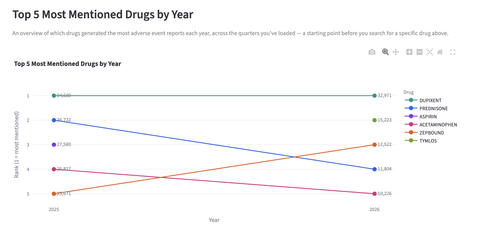
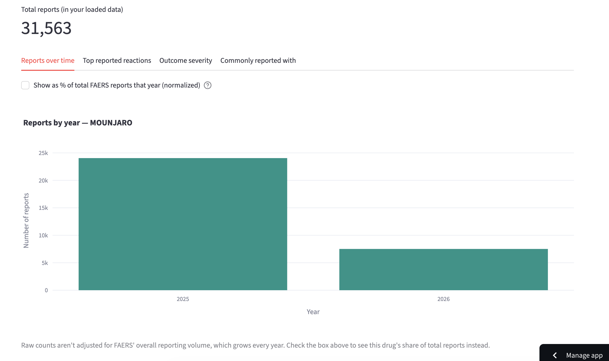
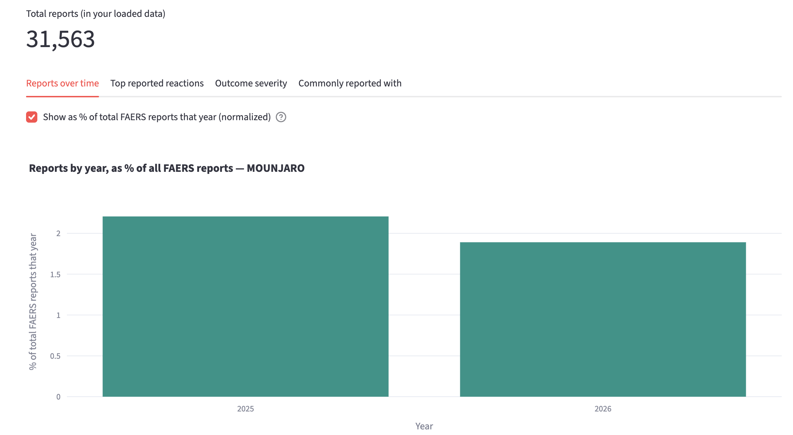
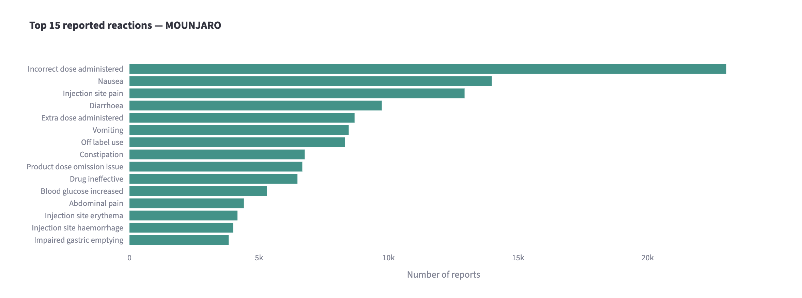
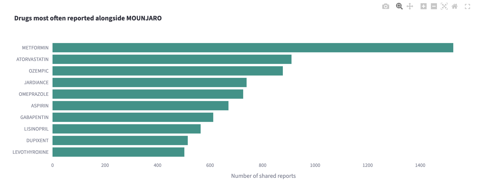
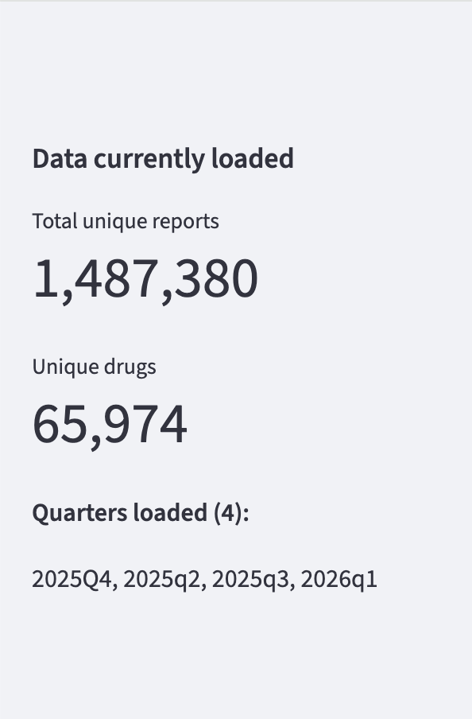

# FAERS Adverse Event Explorer

An interactive dashboard for exploring FDA Adverse Event Reporting System
(FAERS) data — search a drug and see its report volume trends, most
commonly reported reactions, outcome severity, and which other drugs are
most often reported alongside it. Built end-to-end from raw FDA data: the
raw files are notoriously messy (inconsistent drug name formatting,
duplicate/revised case reports across releases), so a real ETL pipeline
sits underneath the dashboard, not a pre-cleaned dataset.

Check out the current version here: https://faers-explorer.streamlit.app/

> **Note on the data:** FAERS is a voluntary, self-reported surveillance
> system. Anyone — patients, doctors, drug manufacturers, lawyers — can
> submit a report, and the FDA does not verify that the drug actually
> caused what was reported. A reaction or outcome appearing here alongside
> a drug reflects what someone *reported*, not a confirmed medical
> finding. Read these figures as a starting point for questions, not as
> medical guidance.

## Features

- **Top 5 Most Mentioned Drugs by Year** — a bump/slope chart (rank over
  time, not raw magnitude) shown on the landing screen before any search,
  giving an overview of which drugs generated the most reports each year
- **Drug search** with normalized matching, so variant spellings/dosage
  strings resolve to the same results
- **Reports over time** — yearly trend, with a toggle between raw counts
  and a normalized view (that drug's share of total FAERS volume that
  year), correcting for the fact that FAERS' overall reporting volume
  grows every year regardless of any individual drug's safety profile
- **Top reported reactions** — most frequent adverse reactions for the
  searched drug
- **Outcome severity** — breakdown of serious outcome types (death,
  hospitalization, life-threatening, etc.), plus a comparison of this
  drug's serious-outcome rate against the overall average across every
  drug in the dataset
- **Commonly reported with** — which other drugs most frequently appear
  on the same report as the searched drug
- **Data coverage sidebar** — always-visible summary of total reports,
  total unique drugs, and which quarters are currently loaded
- Consistent custom theme and chart color palette across the whole app

## Tech stack

- **Python 3.13**, pandas for data cleaning
- **SQLite** for the cleaned, joined, indexed database
- **Streamlit** for the dashboard, **Plotly** for charts
- **Git / GitHub**, with the large database file hosted as a **GitHub
  Release asset** and auto-downloaded by the app on first startup
- Deployed on **Streamlit Community Cloud**

## Project structure

```
faers-explorer/
  app.py                        Streamlit dashboard
  clean_faers_simple.py         Cleans ONE quarter (DEMO, DRUG, REAC, OUTC)
  clean_faers.py                Cleans MULTIPLE quarters combined
  requirements.txt              Python dependencies
  .streamlit/config.toml        Custom theme
  raw_data/                     Downloaded FDA files (not tracked in git)
  faers_clean.db                Generated by the cleaning scripts (not tracked in git)
  screenshots/                  Project screenshots for this README
```

## 1. Download the raw data

FAERS Quarterly Data Files, published by the FDA:
**https://fis.fda.gov/extensions/FPD-QDE-FAERS/FPD-QDE-FAERS.html**

On that page:
1. Scroll to **"Quarterly Data Extract Files"**
2. Pick one or more quarters and click each **ASCII** download link (not
   XML/SGML)
3. Unzip each one into `raw_data/`, so you end up with paths like:
   ```
   raw_data/faers_ascii_2026q1/ASCII/DEMO26Q1.txt
   raw_data/faers_ascii_2026q1/ASCII/DRUG26Q1.txt
   raw_data/faers_ascii_2026q1/ASCII/REAC26Q1.txt
   raw_data/faers_ascii_2026q1/ASCII/OUTC26Q1.txt
   ```

## 2. Set up your environment

```
python3 -m venv venv
source venv/bin/activate        # Windows: venv\Scripts\activate
pip install -r requirements.txt
```

## 3. Clean the data

For a single quarter, edit `QUARTER_CODE` in `clean_faers_simple.py` to
match your download, then run:

```
python3 clean_faers_simple.py
```

For multiple quarters combined, edit the `QUARTERS` list in
`clean_faers.py` to match every quarter you've downloaded (folder-style
names, e.g. `"2026q1"`), then run:

```
python3 clean_faers.py
```

Either script produces `faers_clean.db` — a SQLite database with four
cleaned, joined, indexed tables: `demo`, `drug`, `reac`, `outc`.

**Note on deduplication:** a case's follow-up/revised report can land in a
*different* quarter than its original. `clean_faers.py` combines every
quarter first, then deduplicates globally — deduping quarter-by-quarter
would double-count revised cases.

## 4. Run the dashboard locally

```
streamlit run app.py
```

Opens at `http://localhost:8501` (or the next available port). Search a
drug name (e.g. `ASPIRIN`, `MOUNJARO`, `PREDNISONE`) to explore its data.

## Deployment

Deployed on **Streamlit Community Cloud**, connected to this GitHub repo.

The cleaned database (~1.7GB across 4 quarters) exceeds GitHub's 100MB
per-file commit limit, so it's **not** committed to the repo directly.
Instead:

1. `faers_clean.db` is uploaded as a **GitHub Release asset** (supports up
   to 2GB per file)
2. `app.py` checks for the database on startup; if it's missing (as on a
   fresh deploy), it automatically downloads it from the Release asset URL
   before running any queries

To update the deployed database with new quarters: rebuild
`faers_clean.db` locally with `clean_faers.py`, upload the new file as a
new (or updated) GitHub Release asset, and update `DB_DOWNLOAD_URL` at the
top of `app.py` if the URL changed.

## Known limitations / next steps

- **No causation.** FAERS reports co-occurrence, not cause — see the note
  at the top.
- **Drug name matching is approximate.** Cleaning strips dosage/units and
  punctuation, but doesn't merge brand ↔ generic names (e.g. "TYLENOL" vs
  "ACETAMINOPHEN" won't match) or cleanly split combination drugs. A
  mapping table (e.g. from RxNorm) would improve this.
- **"Commonly reported with" reflects co-mention, not a confirmed
  relationship** — it can capture real co-prescribing patterns, unrelated
  medications a patient happened to also be taking, or both; the data
  alone can't distinguish which.
- **Currently loaded quarters:** 2025 Q2 – 2026 Q1 (4 quarters). Add more
  by repeating step 1 and rerunning `clean_faers.py` with an updated
  `QUARTERS` list.

## Data dictionary

Each FDA download includes `ASC_NTS.pdf` in the `ASCII/` folder, explaining
every column in every file — worth a skim when a field isn't obvious.

## Screenshots of the Main Screens

Below are screenshots of the main features in the data visualization:









